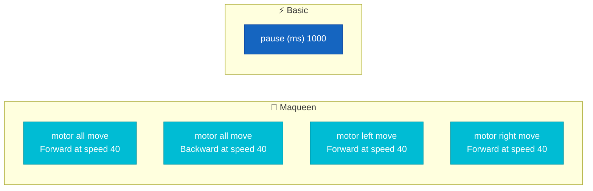
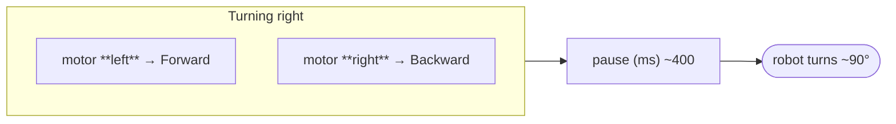

# 🏎️ Challenge 1 — Make it Move

Robotics

Your first goal: write a program that makes Maqueen drive a square — **forward, turn, forward, turn, forward, turn, forward, turn**.

---

## ✅ Your checklist

- [ ] Create a new MakeCode project
- [ ] Add the Maqueen extension (if not done yet — see [Meet Maqueen](index.md))
- [ ] Make Maqueen move forward for 1 second
- [ ] Make Maqueen turn right
- [ ] Repeat until it drives a square (4 sides)
- [ ] Download to the robot and test it
- [ ] **Bonus:** Can you make it drive a triangle instead?

---

## 🧩 Blocks you need

---

## 💡 Hint — how to turn

To turn right, drive the **left motor forward** and the **right motor backward** at the same time:

Play with the pause time until your turn is close to 90°.

---

## 🔗 Example code

Load this in MakeCode and modify it:

[👉 Open example code](https://makecode.microbit.org/_JrXaxVauDKww){ .md-button target="_blank" }

---

## Done? Try this bonus 🌟

!!! tip "Bonus challenge"
    Can you make the LEDs flash while the robot is moving?
    Try adding `LED left on` and `LED right on` from the Maqueen menu.

---

👉 [Challenge 2 — Avoid Obstacles](challenge-2.md){ .md-button .md-button--primary }
