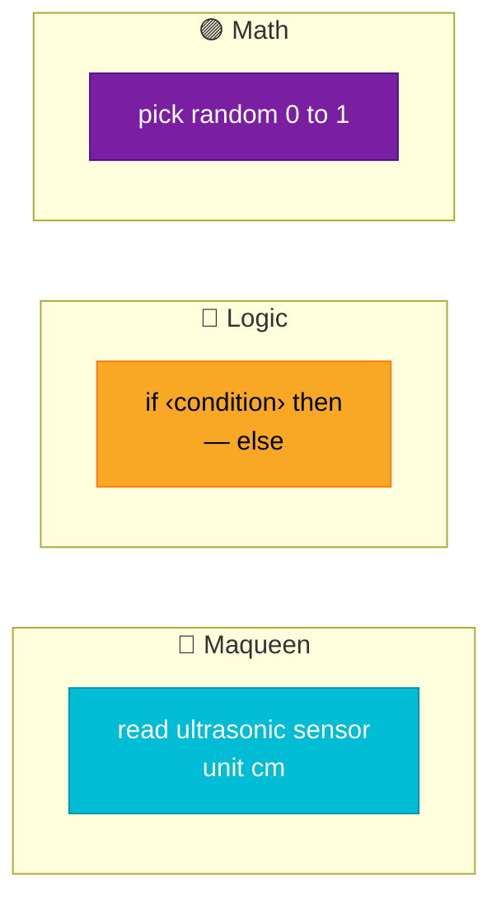
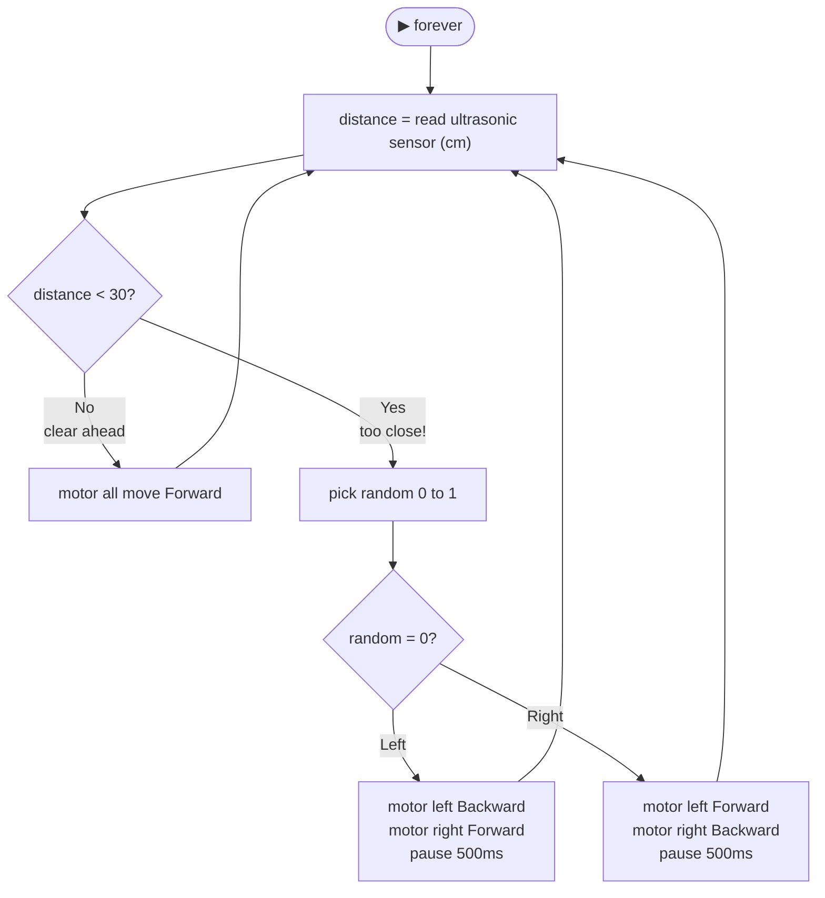

# 🚧 Challenge 2 — Avoid Obstacles

Robotics

Maqueen has an **ultrasonic sensor** on the front — it sends out a sound pulse and measures how long it takes to bounce back. That tells it how far away an obstacle is.

Your challenge: make Maqueen drive forward and **automatically turn away** when it gets too close to something.

---

## ✅ Your checklist

- [ ] Open a new MakeCode project (or keep your challenge 1 code)
- [ ] Add the Maqueen extension
- [ ] Make Maqueen drive forward by default
- [ ] Read the ultrasonic sensor distance
- [ ] If distance is less than 30cm → turn left or right
- [ ] Download and test — put your hand in front of it!
- [ ] **Bonus:** Can you make it beep when it detects something?

---

## 🧩 How the ultrasonic sensor works

!!! info "Sonar — just like a bat!"
    The sensor sends out an ultrasonic pulse (too high-pitched to hear).
    It measures how long the pulse takes to return.
    Distance = speed of sound × time ÷ 2

The MakeCode block gives you the distance in **centimetres** automatically.

---

## 🧩 Blocks you need

---

## 💡 Hint — the logic

---

## 🔗 Example code from the slides

This is the obstacle avoidance code from your teacher's demo:

[👉 Open obstacle avoidance code](https://makecode.microbit.org/64946-39354-43485-37140){ .md-button target="_blank" }

---

👉 [Challenge 3 — Follow a Line](challenge-3.md){ .md-button .md-button--primary }
