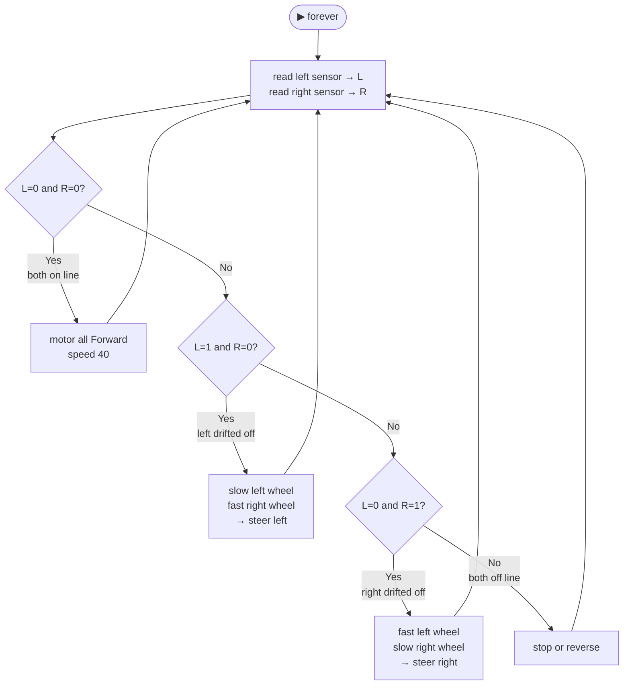
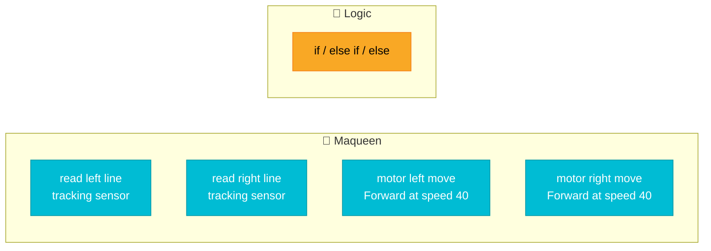

# ⬛ Challenge 3 — Follow a Line

Robotics

Maqueen has **two line-tracking sensors** underneath. They detect whether they're over a black line or a white surface.

Your challenge: make Maqueen follow a black line on the track mat.

---

## ✅ Your checklist

- [ ] Get a track mat from your teacher
- [ ] Place Maqueen on the white area near the black line
- [ ] Write code that reads both sensors
- [ ] Program the robot to steer back onto the line when it drifts
- [ ] Download and test on the track mat
- [ ] **Bonus:** Try increasing the speed — does it still follow the line?

---

## 🧩 How the line sensors work

| Sensor reading | Meaning |
|----------------|---------|
| `0` | Sensor is over a **black line** (LED turns ON) |
| `1` | Sensor is over a **white area** (LED turns OFF) |

There are **two sensors** — left and right. Your code checks both to decide which way to steer.

---

## 💡 The steering logic

---

## 🧩 Blocks you need

---

## 🔗 Example code from the slides

[👉 Open line following code](https://makecode.microbit.org/13062-30541-09778-88218){ .md-button target="_blank" }

!!! tip "Modified version (from the slides)"
    The code in the slides uses speed **40** for the fast wheel and **10** for the slow wheel to make smoother turns. Start with this and adjust from there.

---

## 🌟 You've completed all 3 challenges!

Nice work — you've programmed a robot to move, sense, and react to the world around it.

That's the core of **robotics engineering**.

👉 [Free Choice — what's next?](../free-time.md){ .md-button .md-button--primary }
