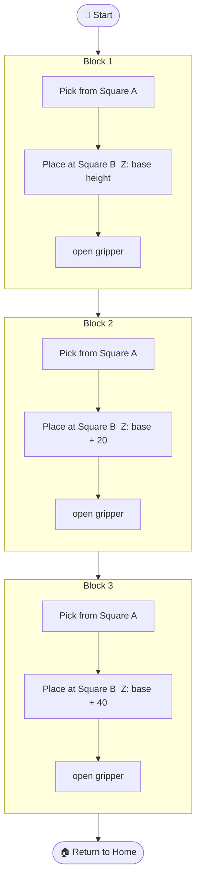
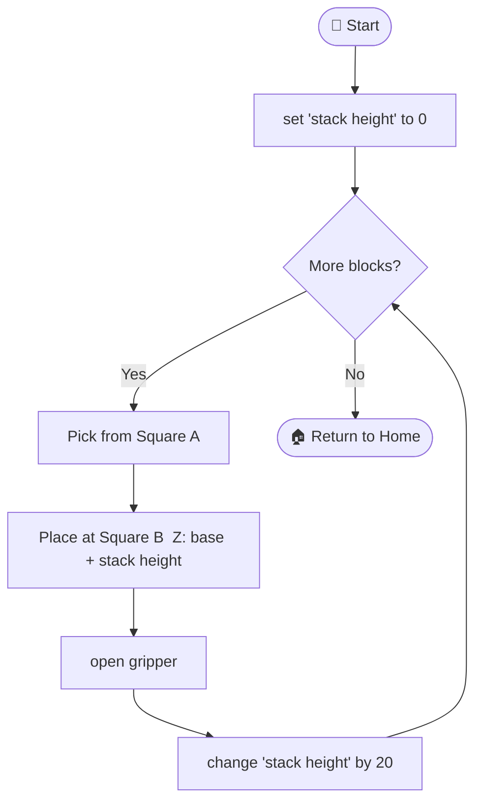

# 🏗️ Challenge — Stack the Blocks!

Robot Arm

You've got a working pick-and-place program. Now for the real challenge:

**Can you stack the blocks into a tower — one on top of another?**

---

## The challenge

  <h3>🟥 Stack 'em up!</h3>
  
Use your pick-and-place program to stack blocks on top of each other in Square B.

  
Keep going until the tower falls over!

  
<strong>How high can you go?</strong>

---

## What makes this tricky

Each time you add a block to the tower, it's **taller** than the last one.

That means your **Z value for placing changes** every time — you need to drop the block a little higher each round.

!!! info "Rough guide"
    Most blocks are about **20mm tall**. So:
    - 1st block placed: Z ≈ your original place height
    - 2nd block: Z + 20
    - 3rd block: Z + 40
    - 4th block: Z + 60
    - ...and so on

---

## ✅ Your mission

### Level 1 — Manual stacking

Modify your program to place **3 blocks** in a stack, one at a time.

Change the Z place value each time — each block is ~20mm taller than the last:

---

### Level 2 — Use a variable (harder!)

Instead of writing the Z value out each time, use a **variable** to keep track:

!!! note "Using variables in WonderCode"
    1. Go to **Variables** in the block palette
    2. Click **Make a Variable** — call it `stack height`
    3. Set it to `0` at the start
    4. Each time you place a block, **change `stack height` by 20**
    5. Use `stack height` inside your `move arm to Z:` block

This way you can stack as many blocks as you like without changing your code!

---

### Level 3 — The tower challenge 🏆

Run your program and keep adding blocks to the stack.

- How many blocks before it topples?
- Can you slow the arm down near the top to be more precise?
- Can you make the arm go back and pick up a fallen block?

!!! tip "If the tower keeps falling"
    - Try placing each block **more slowly** (lower speed near the top)
    - Make sure Square B is on a flat, stable part of the mat
    - Are your blocks all the same size? Check the Z step value

---

## 🏆 Class record

Keep track — write your best stack height on the whiteboard!

---

## What's next?

Finished stacking? Try the advanced colour sensor challenge:

👉 [Advanced — Colour Sensor](advanced.md){ .md-button .md-button--primary }
