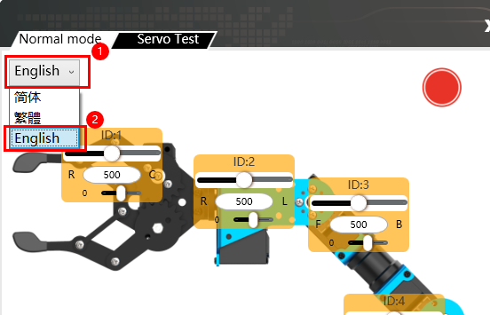

# 🦾 Meet the xArm 2.0

Robot Arm

This is a real **5-axis robot arm** — the same kind of technology used in factories, warehouses, and research labs. Today you'll program it using the **HiWonder PC Software**, which lets you build sequences of movements by adjusting servo sliders and recording each position.

---

## What's in front of you

  

    🦾
    xArm AI
    5 servo joints, gripper claw
  

  

    🔌
    Micro-USB Cable
    Connects the arm's control board to the computer
  

  

    💻
    HiWonder PC Software
    Servo control app already installed on the computer
  

  

    🟥🟦
    Blocks + mat
    Coloured blocks and a placemat with marked squares
  

---

## How to connect the arm

!!! note "Step by step"
    1. Plug the **power adapter** into the arm and flip the switch on
    2. Connect the **micro-USB cable** from the arm's control board to your computer
    3. Double-click the **xArm PC Software** shortcut on the desktop
    4. The connection indicator (top-left) will turn **green** when the arm is detected ✅
    5. The arm may move slightly to its home position when it connects — that's normal!

!!! warning "Important"
    - Don't force the arm joints — the servos are strong but not unbreakable
    - Keep your fingers clear when the arm is moving
    - If the arm moves somewhere unexpected, click **Stop** immediately

---

## The PC Software interface

| Area | What it does |
|---|---|
| **① Connection status** (top-left) | Green = connected, Red = not connected |
| **② Servo control area** (left panel) | Sliders to adjust each servo (ID 1–6) position (0–1000) |
| **③ Action data list** (centre) | The sequence of recorded actions — each row is one position |
| **④ Action group buttons** (right) | Add, delete, run, save and download action groups |
| **⑤ Servo settings** (bottom) | Language, read/save deviation settings |

---

## How servo positions work

Instead of X/Y/Z coordinates, the arm uses **servo position values** for each of its 6 joints.

| Servo | Controls |
|---|---|
| **ID 1** | Base rotation (left/right) |
| **ID 2** | Shoulder (forward/back) |
| **ID 3** | Elbow |
| **ID 4** | Wrist pitch |
| **ID 5** | Wrist rotation |
| **ID 6** | Gripper (open/close) |

Each servo value runs from **0 to 1000**. You find the right position by moving the sliders and watching the arm respond in real time.

!!! tip "Finding a position"
    Drag a servo slider slowly — the arm moves live. When it's where you want it, note down all the servo values, then click **"Add Action"** to record that position.

---

## Ready to start the lesson?

👉 [Lesson — Pick & Place](lesson.md){ .md-button .md-button--primary }
