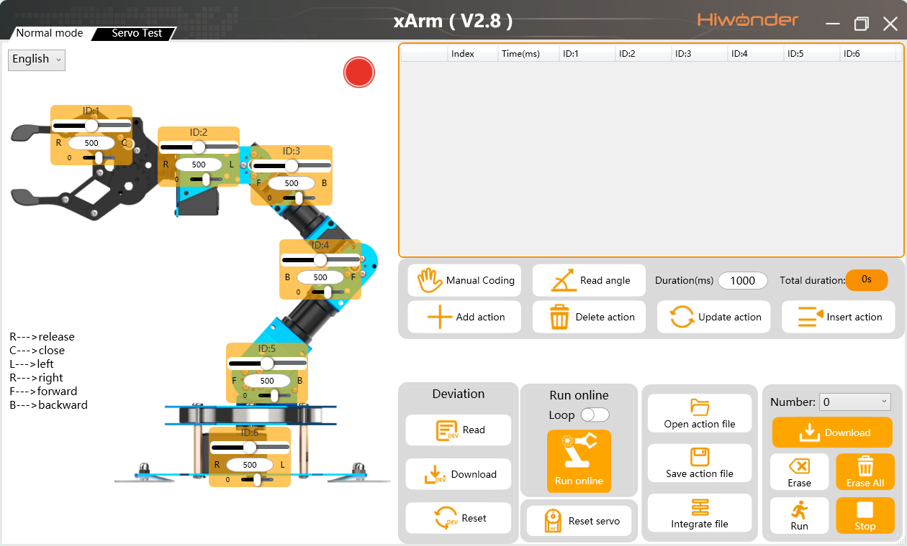
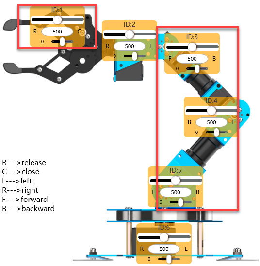
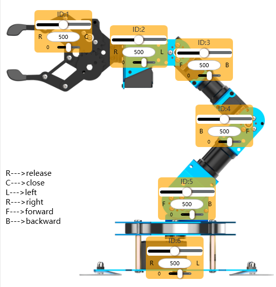
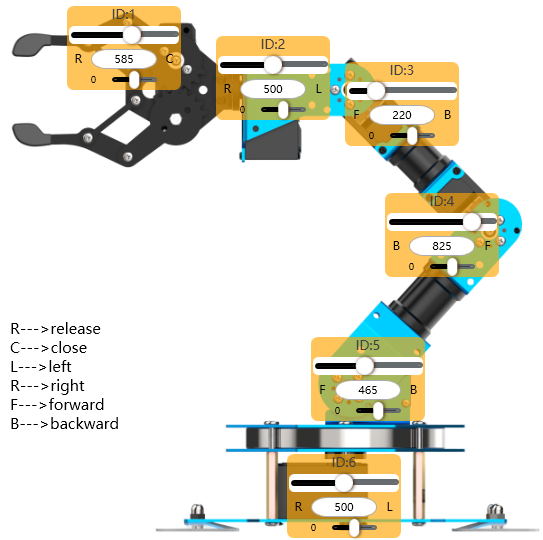
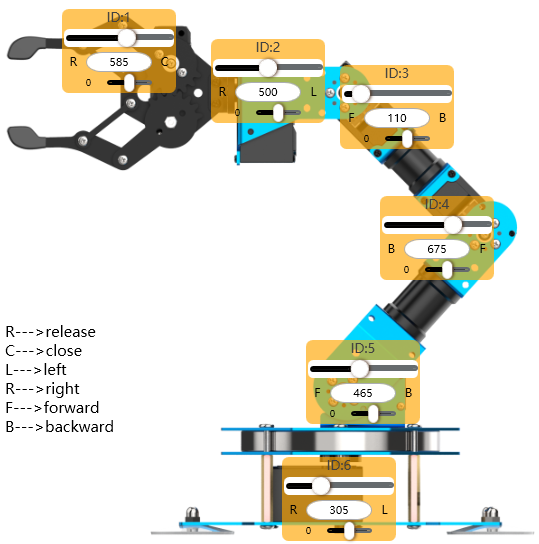
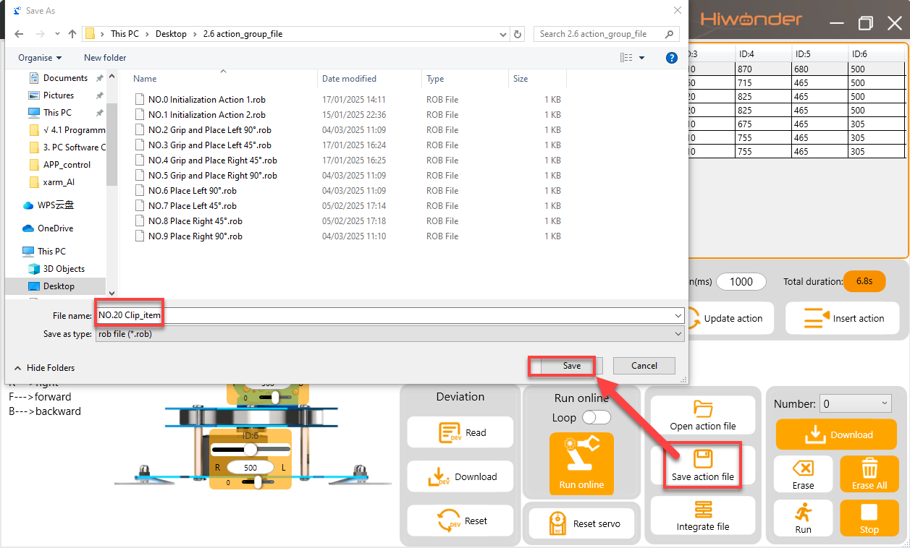

# 🧩 Lesson — Pick & Place

Robot Arm

In this lesson you'll use the **HiWonder PC Software** to program the xArm AI to pick up a block from one square on the mat and place it on another. You'll do this by recording a sequence of **actions** — each one is a snapshot of all the servo positions at a key point in the movement.

---

## What you'll build

A 9-action sequence that moves the arm through these stages:

1. **Home** — safe neutral position above the mat
2. **Hover above Square A** — arm moves over the block, gripper open
3. **Lower to Square A** — down to block height
4. **Close gripper** — grasp the block
5. **Lift up** — raise the block clear of the mat
6. **Hover above Square B** — move across to the target square
7. **Lower to Square B** — down to place height
8. **Open gripper** — release the block
9. **Return to Home** — safe finish position

---

## ✅ Step 1 — Open the software and connect

!!! note "Connect the arm"
    1. Make sure the arm is powered on (switch on the back of the base)
    2. Plug the micro-USB cable from the control board into the computer
    3. Double-click the **xArm PC Software** on the desktop
    4. Check the connection indicator (top-left) — it must be **green** before you continue

---

## ✅ Step 2 — Understand the workflow

The PC software works differently from Scratch. Instead of dragging blocks, you:

1. **Move the arm** by dragging the servo sliders (left panel)
2. **Set the time** — how long the arm takes to move to this position (in milliseconds)
3. Click **"Add Action"** — this records the current servo values as one step
4. Repeat for each key position
5. Click **"Run"** to play back the whole sequence

!!! tip "Time values"
    - `1000 ms` = 1 second — good for most moves
    - `500 ms` — faster, for small adjustments (like opening/closing the gripper)
    - Too fast and the arm will jerk or miss the target — start slow!

---

## ✅ Step 3 — Record the Home position (Action 1)

The arm should already be at or near home. If not, click **"Reset"** to return it.

1. Make sure the gripper is **open** — drag the **ID 6** slider toward 0
2. Set the **Time** to `1000`
3. Click **"Add Action"**

You should see one row appear in the action data list. That's Action 1 — Home.

---

## ✅ Step 4 — Find your key positions

You need to find servo values for **four positions** on the mat:

| Position | What it is |
|---|---|
| **Hover A** | Arm tip hovering above Square A, gripper open |
| **Down A** | Arm lowered to block height in Square A |
| **Hover B** | Arm tip hovering above Square B, gripper open |
| **Down B** | Arm lowered to place height in Square B |

!!! note "How to find a position"
    1. Drag the servo sliders one at a time — the arm moves live
    2. When the arm tip is where you want it, note down the ID values on paper
    3. You'll use these values when recording each action below

!!! tip "Work from the base outward"
    Adjust **ID 1** (base rotation) first to swing the arm over the target square, then adjust **ID 2, 3, 4** to reach the height and depth you need.

---

## ✅ Step 5 — Record the pick sequence (Actions 2–5)

Work through these four positions in order. For each one:
- Adjust the sliders to match the position
- Set the time shown
- Click **"Add Action"**

**Action 2 — Hover above Square A**

Arm over Square A, ~5 cm above the block, gripper open (ID 6 ≈ 0).

Set time: `1000` → **Add Action**

---

**Action 3 — Lower to Square A**

Lower the arm until the gripper jaws are level with the sides of the block. Keep ID 6 open.

Set time: `800` → **Add Action**

---

**Action 4 — Close gripper**

Close the gripper around the block — drag **ID 6** slider up until the jaws grip the block firmly (not too tight).

Set time: `500` → **Add Action**

---

**Action 5 — Lift up**

Raise the arm back up to hover height (same as Action 2, with gripper closed).

Set time: `800` → **Add Action**

---

## ✅ Step 6 — Record the place sequence (Actions 6–8)

**Action 6 — Hover above Square B**

Swing the arm over Square B, same hover height, gripper still closed.

Set time: `1000` → **Add Action**

---

**Action 7 — Lower to Square B**

Lower the arm until the block is just above the mat surface.

Set time: `800` → **Add Action**

---

**Action 8 — Open gripper**

Open the gripper to release the block — drag **ID 6** back toward 0.

Set time: `500` → **Add Action**

---

## ✅ Step 7 — Return to Home (Action 9)

Move all sliders back to the Home values you recorded in Step 3.

Set time: `1000` → **Add Action**

Your action list should now have **9 rows**.

---

## ✅ Step 8 — Run and test!

1. Click **"Run"** — the arm will execute all 9 actions in order
2. Watch each stage — does it go where you expect?
3. If the gripper misses the block, **double-click** the row in the action list to edit it, then adjust the servo values and click **"Update Action"**

!!! tip "Tweaking the grip height"
    - Gripper too high: closes but misses the block — lower ID 2/3 a little
    - Gripper too low: arm scrapes the mat — raise ID 2/3 slightly
    - Right: jaws close cleanly around the sides of the block

---

## ✅ Step 9 — Save your action group

!!! note "Save your work"
    1. Click **"Save File"**
    2. In the pop-up, give it a name like `pick-place-1` and choose a number (e.g. 1)
    3. Click **Save**

---

## ✅ Done! What's next?

You've got a working pick-and-place action group. Now try the stacking challenge:

👉 [Challenge — Stack the Blocks!](challenge.md){ .md-button .md-button--primary }
