# 🧩 Lesson — xArm AI PC Software

Robot Arm

---

## 3.1.2 Device Connection

1. Connect the power adapter to the robotic arm and turn the switch on. Use a micro-USB cable to connect the control board to your computer, then double-click to open the PC software. **Once the device is connected, the software will automatically detect it and install any required drivers.**

2. When the connection is successful, the red icon in the top-left of the main interface will turn **green**.

---

## 3.1.3 Interface Overview

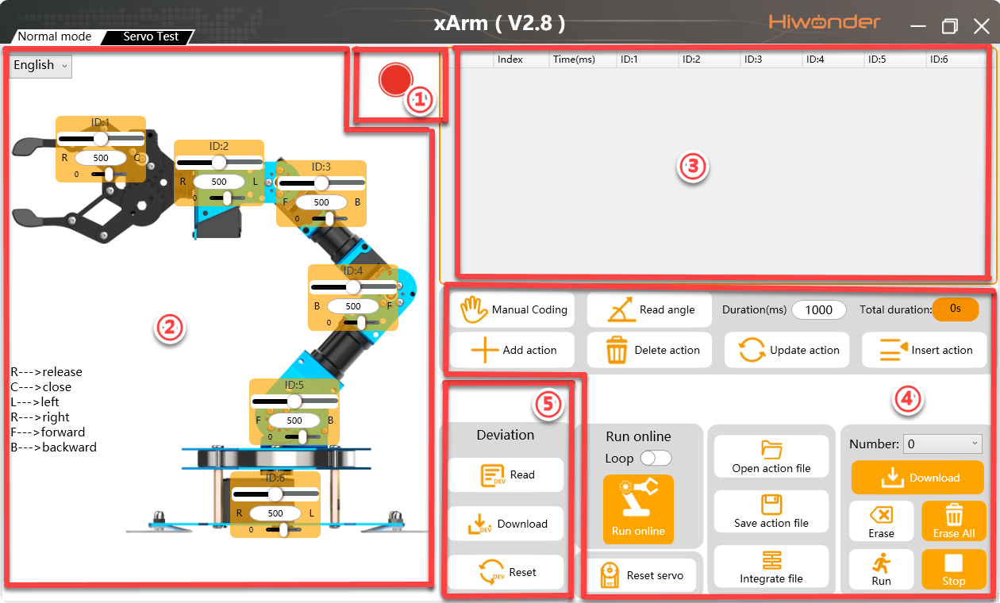

### ① Device Connection Status

| Icon | Function |
|---|---|
|  | Shows whether the device is connected. **Green** = connected; **Red** = not connected or disconnected. |

### ② Servo Control Area

Displays the currently selected servo. Adjust the slider to change that servo's position.

| Icon | Function |
|---|---|
|  | Servo ID number (e.g. ID 2) |
|  | Servo position slider. Range: 0–1000. |
| 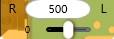 | Servo deviation slider. Range: −100 to +100. |

### ③ Action Data List

Shows the time and servo values for each recorded action.

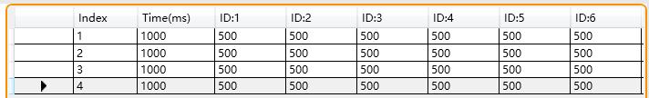

| Icon | Function |
|---|---|
| 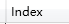 | Action group number. Up to 230 action groups, each holding up to 1020 actions. |
| 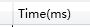 | Action duration — how long the arm takes to execute this action. |
|  | Servo ID column. The value below is the servo position for that action. Double-click  to edit the value directly. |

### ④ Action Group Settings

| Icon | Function |
|---|---|
| 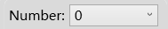 | Select action group number (0–230). Group 0 is the default **"Attention"** pose. |
|  | Download the current action list to the controller. This overwrites any existing actions at that number. |
|  | ⚠️ **Delete all** action group data (groups 0–230). Use with caution. |
| 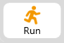 | Run the selected action group once. |
|  | Stop the currently running action group. |
|  | Add a new action using the current servo values. |
|  | Delete the selected action from the list. |
|  | Update the selected action with the current servo values. |
|  | Insert a new action before the selected action. |
| 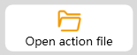 | Open an action group file and load it into the action list. |
|  | Save the current action list to a file. |
|  | Append (integrate) another action group onto the currently loaded one. |
| 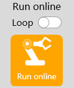 | Run the action group in the current list. Enable **Loop** to repeat continuously. |
|  | Reset all servos to their initial (home) position. |
|  | Loosen all joints so you can move the arm by hand. |
|  | Read angle data from manual programming mode. |

### ⑤ Servo Settings

| Icon | Function |
|---|---|
| 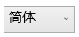 | Set the software language. |
|  | Read deviation values saved on the controller. |
|  | Download the deviation values from the software to the arm. |
|  | Clear deviation values in the software (the controller's saved values are unchanged). |

---

## 3.3.2 Action Programming — How It Works

The workflow is simple: **move the arm to a position, then click Add Action. Repeat.**

Here's a quick 3-step example to see it in action:

**(1)** Make sure the arm is connected and at its home (upright) position. Set the time to `1000`, then click **"Add Action"** — this records the home position as Action 1.

**(2)** Drag the servo sliders to move the arm forward to a new position. Set the time, then click **"Add Action"** again.

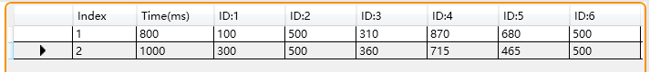

**(3)** Move the arm back to the home position. Click **"Add Action"** once more.

Now click **"Run"** — the arm will move through all three positions in sequence.

!!! tip "Hold for fine adjustments"
    Hold down the left mouse button and tap the slider for small, precise movements.

!!! tip "Manual Coding — move the arm by hand"
    Click the **"Manual Coding"** button () to loosen the arm's joints.
    You can then physically move the arm into any pose with your hands.
    When it's in the right position, click **"Add Action"** to record it — no sliders needed.

---

## 🎯 Your Task — Pick & Place

Now it's your turn. Use what you've just learned to program the xArm AI to pick up a block from one square on the mat and place it on another — by recording a sequence of **actions**, each one a snapshot of all servo positions at a key stage of the movement.

---

## What you'll build

A 9-action sequence that moves the arm through these stages:

1. **Home** — safe neutral position above the mat
2. **Hover above Square A** — arm moves over the block, gripper open
3. **Lower to Square A** — down to block height
4. **Close gripper** — grasp the block
5. **Lift up** — raise the block clear of the mat
6. **Hover above Square B** — move across to the target square
7. **Lower to Square B** — down to place height
8. **Open gripper** — release the block
9. **Return to Home** — safe finish position

---

## ✅ Step 1 — Open the software and connect

!!! note "Connect the arm"
    1. Make sure the arm is powered on (switch on the back of the base)
    2. Plug the micro-USB cable from the control board into the computer
    3. Double-click the **xArm PC Software** on the desktop
    4. Check the connection indicator (top-left) — it must be **green** before you continue

---

## ✅ Step 2 — Record the Home position (Action 1)

The arm should already be at or near home. If not, click **"Reset"** to return it.

1. Make sure the gripper is **open** — drag the **ID 6** slider toward 0
2. Set the **Time** to `1000`
3. Click **"Add Action"**

You should see one row appear in the action data list. That's Action 1 — Home.

---

## ✅ Step 3 — Find your key positions

You need to find servo values for **four positions** on the mat:

| Position    | What it is                                    |
| ----------- | --------------------------------------------- |
| **Hover A** | Arm tip hovering above Square A, gripper open |
| **Down A**  | Arm lowered to block height in Square A       |
| **Hover B** | Arm tip hovering above Square B, gripper open |
| **Down B**  | Arm lowered to place height in Square B       |

!!! note "How to find a position"
    1. Drag the servo sliders one at a time — the arm moves live
    2. When the arm tip is where you want it, note down the ID values on paper
    3. You'll use these values when recording each action below

!!! tip "Work from the base outward"
    Adjust **ID 1** (base rotation) first to swing the arm over the target square, then adjust **ID 2, 3, 4** to reach the height and depth you need.

---

## ✅ Step 4 — Record the pick sequence (Actions 2–5)

Work through these four positions in order. For each one:
- Adjust the sliders to match the position
- Set the time shown
- Click **"Add Action"**

**Action 2 — Hover above Square A**

Arm over Square A, ~5 cm above the block, gripper open (ID 6 ≈ 0).

Set time: `1000` → **Add Action**

---

**Action 3 — Lower to Square A**

Lower the arm until the gripper jaws are level with the sides of the block. Keep ID 6 open.

Set time: `800` → **Add Action**

---

**Action 4 — Close gripper**

Close the gripper around the block — drag **ID 6** slider up until the jaws grip the block firmly (not too tight).

Set time: `500` → **Add Action**

---

**Action 5 — Lift up**

Raise the arm back up to hover height (same as Action 2, with gripper closed).

Set time: `800` → **Add Action**

---

## ✅ Step 5 — Record the place sequence (Actions 6–8)

**Action 6 — Hover above Square B**

Swing the arm over Square B, same hover height, gripper still closed.

Set time: `1000` → **Add Action**

---

**Action 7 — Lower to Square B**

Lower the arm until the block is just above the mat surface.

Set time: `800` → **Add Action**

---

**Action 8 — Open gripper**

Open the gripper to release the block — drag **ID 6** back toward 0.

Set time: `500` → **Add Action**

---

## ✅ Step 6 — Return to Home (Action 9)

Move all sliders back to the Home values you recorded in Step 2.

Set time: `1000` → **Add Action**

Your action list should now have **9 rows**.

---

## ✅ Step 7 — Run and test!

1. Click **"Run"** — the arm will execute all 9 actions in order
2. Watch each stage — does it go where you expect?
3. If the gripper misses the block, **double-click** the row in the action list to edit it, then adjust the servo values and click **"Update Action"**

!!! tip "Tweaking the grip height"
    - Gripper too high: closes but misses the block — lower ID 2/3 a little
    - Gripper too low: arm scrapes the mat — raise ID 2/3 slightly
    - Right: jaws close cleanly around the sides of the block

---

## ✅ Step 8 — Save your action group

!!! note "Save your work"
    1. Click **"Save File"**
    2. In the pop-up, give it a name like `pick-place-1` and choose a number (e.g. 1)
    3. Click **Save**

---

## ✅ Done! What's next?

You've got a working pick-and-place action group. Now try the stacking challenge:

👉 [Challenge — Stack the Blocks!](challenge.md){ .md-button .md-button--primary }

