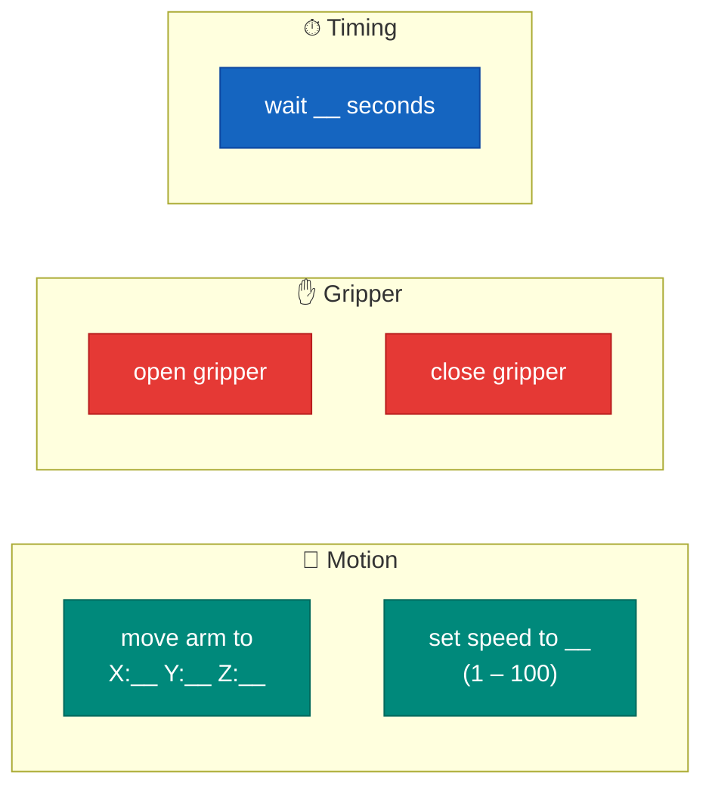
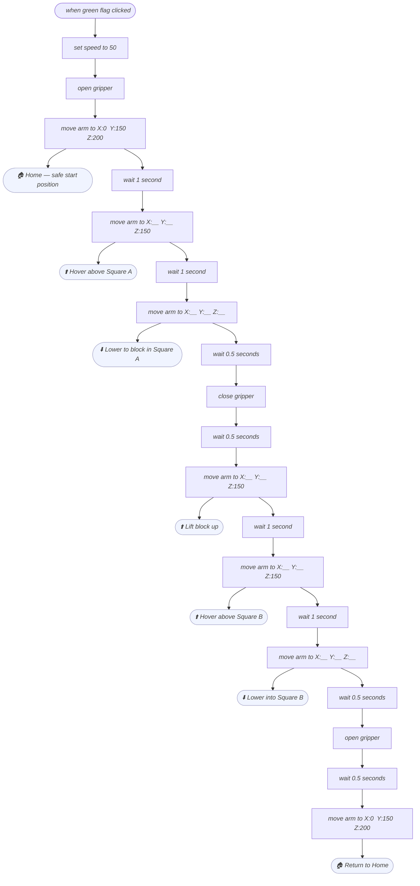

# 🧩 Lesson — Fixed-Point Motion

Robot Arm

In this lesson you'll program the xArm 2.0 to move to **exact positions** in space. This is called **fixed-point motion** — the arm goes to a set of X, Y, Z coordinates you tell it.

This is how real industrial robots work: you teach the arm the positions, then it repeats them reliably every time.

---

## What you'll build

A program that moves the arm through **three positions**:

1. **Home** — a safe neutral position above the mat
2. **Pick** — above Square A on the mat (where a block is)
3. **Place** — above Square B on the mat (where you want it)

---

## ✅ Step 1 — Open the starter file

!!! note "Load the example"
    1. Open **WonderCode** and connect the arm (see [Meet xArm 2.0](index.md))
    2. Go to **File → Open**
    3. Navigate to the lesson folder your teacher has set up, and open  
       `Fixed-Point Motion.sb3`
    4. You should see a short example program already in the script area

Take a moment to read through the blocks — don't run it yet!

---

## ✅ Step 2 — Understand the blocks

!!! tip "Always add a wait after each move"
    The arm needs time to reach the target position before the next block runs.
    Add a `wait 1 second` block after every move.

---

## ✅ Step 3 — Find your coordinates

You need to find the X, Y, Z coordinates for **Square A** and **Square B** on your placemat.

!!! note "How to find a coordinate"
    1. In WonderCode, click the **Manual Control** panel
    2. Use the sliders or arrow buttons to move the arm tip to hover over Square A
    3. Read off the X, Y, Z values shown on screen — write them down!
    4. Do the same for Square B

Your coordinates will be slightly different depending on where the mat is positioned — that's fine.

| Position | Approx. X | Approx. Y | Approx. Z (hover) | Z (down to pick) |
|---|---|---|---|---|
| Home | 0 | 150 | 200 | — |
| Square A hover | ___ | ___ | 150 | ___ |
| Square B hover | ___ | ___ | 150 | ___ |

---

## ✅ Step 4 — Build your first program

Build this sequence in WonderCode — each box below is one block:

Fill in the `__` values with the coordinates you found in Step 3.

!!! warning "Always end at Home"
    Finishing at the Home position means the arm is safe and out of the way.
    Never end a program with the arm hanging over the mat.

---

## ✅ Step 5 — Test it!

1. Click the **green flag** to run your program
2. Watch the arm — does it go where you expect?
3. If it misses the block, adjust the Z value (lower = closer to the mat)
4. Fine-tune until the arm picks up the block cleanly

!!! tip "Tweaking Z height"
    - Too high: gripper closes but misses the block
    - Too low: arm scrapes the mat
    - Right: gripper just closes around the sides of the block

---

## ✅ Done! What's next?

You've got a working pick-and-place program. Now try the extension challenge:

👉 [Challenge — Stack the Blocks!](challenge.md){ .md-button .md-button--primary }
